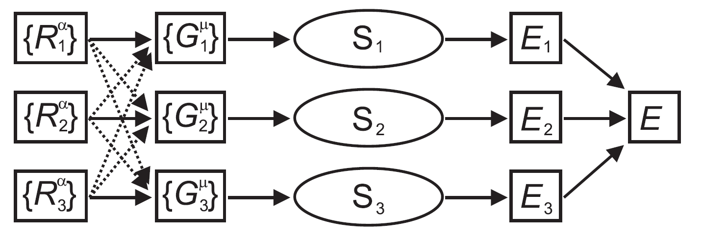
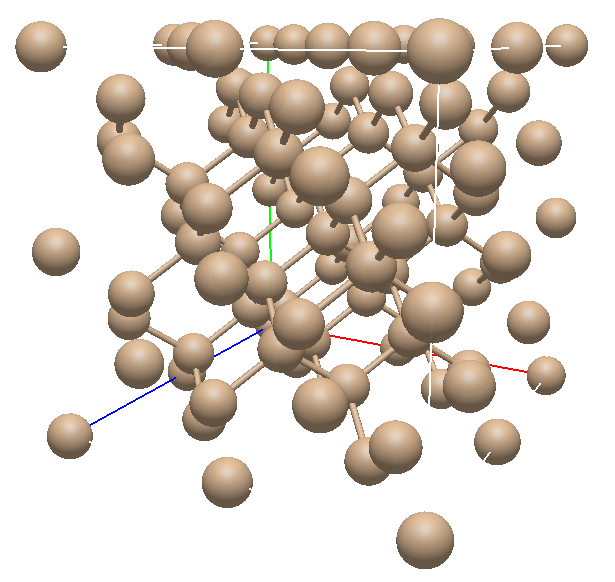

# Neural Network Potential for Silicon (64-atom bulk) — MMOM Project

**Authors:** Francesco Grassi (10841139) and Giorgio Venezia (1080030)
**Course:** Molecular Modeling of Materials (MMOM)

End-to-end machine-learning pipeline that learns a Behler–Parrinello Neural Network Potential (NNP) for bulk Silicon and uses it to run molecular dynamics (MD) from scratch, with physical validation (RDF, VDOS, thermal conductivity via Müller-Plathe).

> **Final, self-contained deliverable:** everything needed to reproduce the results is in this folder (`GrassiVenezia_Neural_Network_Potential/`). The repository root contains development history (intermediate notebooks, sweep models, trial trajectories).

---

## 1. What this project does

1. **Data generation (LAMMPS, Stillinger-Weber):** 64-atom Si diamond bulk, 6-phase protocol: 300 K equilibration → heating 300→1500 K → 1500 K hold → melting at 3000 K → quench 3000→300 K → amorphous equilibration. Dumps `id, x, y, z, fx, fy, fz, pe/atom` every 1000 steps (~9000 frames, ~576k atomic environments).
2. **Feature engineering:** translational/rotational-invariant Behler–Parrinello symmetry functions (G1 radial + G2 angular, Gastegger-shifted parametrization, SW cutoff `Rc = 3.7712 Å`, `N_RADIAL = 32`, `N_ANGULAR = 16`).
3. **Training (PyTorch):** atom-centered FeedForwardNet, total energy as sum of atomic energies. Best config below. Early stopping + ReduceLROnPlateau + mixed precision.
4. **Force evaluation:** analytic Cartesian forces via autograd: `F_i = -∇_{R_i} E_total` through symmetry functions.
5. **MD from scratch:** custom Velocity Verlet (`N_STEPS = 10000`, `dt = 1 fs`), Maxwell–Boltzmann init at 300 K (and 3000 K test), periodic boundaries, XYZ trajectory output.
6. **Validation:** Radial Distribution Function (RDF), Vibrational Density of States via VACF FFT (VDOS), Müller-Plathe RNEMD thermal conductivity.




## 2. Results (best model)

Model file: `models/experiment_hl2_hs64_dr0p0_bs128_lr0p0001_ep1500_pt75_l20p0_0719-1424_model.pt`
TensorBoard logs: `networks/experiment_hl2_hs64_dr0p0_bs128_lr0p0001_ep1500_pt75_l20p0_0719-1424/`

| Split | MAE (eV, total) | RMSE (eV, total) | RMSE/atom | R² |
|---|---|---|---|---|
| Val | 0.338 | 0.561 | — | 0.9992 |
| Test | 0.342 | **0.548** | **8.56 meV/atom** | **0.9992** |

- **Forces (test, vs SW):** RMSE ≈ **0.86 eV/Å** (Fx 0.859, Fy 0.862, Fz 0.860; 450 frames × 64 atoms).
- **Müller-Plathe (demo, 100k steps, 20 slabs):** `Jz ≈ 4.33e10 W/m²`, `dT/dz ≈ 15 K/Å`, `κ ≈ 0.29 W/(m·K)`. Full-convergence run would need ~2M steps (~9 h).
- **RDF/VDOS:** crystalline peaks at 300 K, broadened liquid-like profile at 3000 K — qualitatively correct.

Hyperparameters (best): `HIDDEN_LAYERS=2, HIDDEN_SIZE=64, DROPOUT=0.0, BATCH_SIZE=128, LR=1e-4 (AdamW), EPOCHS=1500, PATIENCE=75, L2=0.0, SEED=42`.

## 3. Folder structure

```text
GrassiVenezia_Neural_Network_Potential/
├── GrassiVenezia_NNP.ipynb   # full pipeline: EDA → symmetry functions → train → forces → MD → RDF/VDOS → Müller-Plathe
├── README.md                 # this file
├── requirements.txt          # Python dependencies
├── assets/                   # figures used in the notebook
│   ├── NNP_schema.png
│   ├── NNP_single_schema.png
│   └── silicon_bulk.png
├── lammps/
│   ├── si.lmp                # 6-phase SW protocol that generated dataset64.dump
│   ├── dataset64.dump        # LAMMPS trajectory (LFS-tracked)
│   └── dataset64.csv         # parsed CSV (git-ignored, >50 MB — auto-regenerated by notebook)
├── models/
│   └── experiment_hl2_hs64_dr0p0_bs128_lr0p0001_ep1500_pt75_l20p0_0719-1424_model.pt  # best model
└── networks/
    └── experiment_hl2_hs64_dr0p0_bs128_lr0p0001_ep1500_pt75_l20p0_0719-1424/  # TensorBoard events
```

Generated at runtime (git-ignored): `lammps/silicon_symmetry_dataset_64_forces.csv`, `md_simulation_*.xyz`.

## 4. Quickstart

### 4.1 Python environment

```bash
cd GrassiVenezia_Neural_Network_Potential
python -m venv .venv && source .venv/bin/activate
pip install -r requirements.txt
```

Requires Python 3.10+, PyTorch (CUDA 11.8 build recommended for GPU, MPS/CPU work too), TensorBoard.

### 4.2 (Optional) Regenerate LAMMPS data

The dump is already included. To rerun:

```bash
cd lammps
lmp -in si.lmp
# produces dataset64.dump
cd ..
```

`dataset64.csv` (52 MB, 576k rows) is intentionally git-ignored (`*.csv`); the notebook rebuilds it automatically via `parse_lammps_dump_to_csv()` if missing.

### 4.3 Run the notebook

Open `GrassiVenezia_NNP.ipynb` (VS Code / Jupyter) and run top-to-bottom:

1. Libraries + `SEED = 42`
2. Data loading (auto CSV parse) + EDA
3. Symmetry functions (`generate=True` on first run — compute-heavy, uses `numba`)
4. Train/test split by `frame_id` (90/5/5), StandardScaler on symmetry functions, mean-shift on total energy
5. Train (`fit()` with early stopping, TensorBoard to `networks/<experiment_name>`)
6. Inference, force RMSE, Velocity Verlet MD, RDF/VDOS, Müller-Plathe

Monitor training:

```bash
tensorboard --logdir networks
```

Trained weights are already in `models/` — inference/MD cells work without retraining.

## 5. Method notes

- **Invariances:** raw `(x,y,z)` are never fed to the net; only `G1/G2` symmetry functions with minimum-image PBC.
- **Energy sum:** `E_total = Σ_i E_i`; one shared atomic network applied per atom, summed per frame. This generalizes across system sizes.
- **Split hygiene:** split is by `frame_id`, never by atom-row, to avoid leakage between train/val/test.
- **Forces:** single differentiable graph `R → G(R) → E(G) → F = -dE/dR` (no finite differences).
- **MD units:** metal units (Å, eV, ps); `FORCE_CONVERSION = 9648.5332`; COM drift removed; exact-T rescale on init.
- **Known limits:** energy-only loss (forces not in loss → force RMSE ~0.86 eV/Å); SW ground truth, not DFT; short demo RNEMD underestimates κ.

## 6. Repository root (dev history, not needed to reproduce)

```text
../
├── MolModMaterialsProject*.ipynb  # v1–v5 development iterations
├── Learn_LJ_potential.ipynb
├── extract_dump.py                # standalone dump→CSV converter
├── lammps/, Si_dataset/           # early SW trials, solid/liquid/amorphous splits
├── models/, networks/             # hyperparameter sweep checkpoints + TensorBoard logs
├── md_simulation_*.xyz            # trial NNP-driven trajectories
├── history.txt                    # sweep RMSE log
└── *.png, *.cif, *.xyz            # exploratory figures / 64-atom crystal
```

## 7. Reproducibility

- All RNGs seeded (`PYTHONHASHSEED`, `random`, `numpy`, `torch`, CUDA/MPS) with `SEED = 42`.
- Best experiment name encodes config + timestamp: `hl2_hs64_dr0p0_bs128_lr0p0001_ep1500_pt75_l20p0_0719-1424`.
